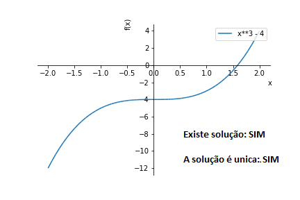
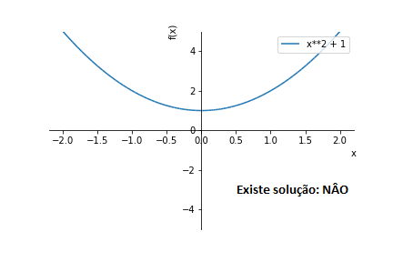
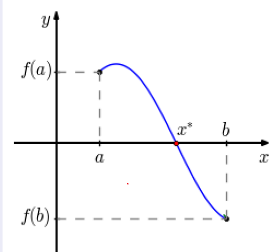
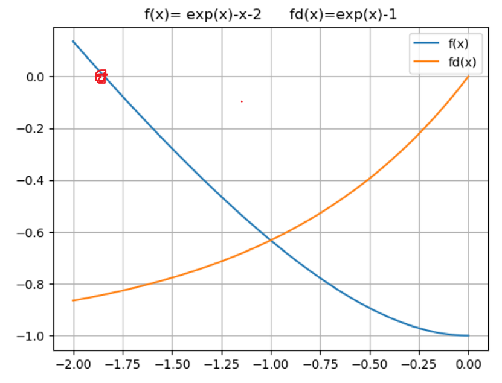

# 📌 Zeros de uma função

## ⭐ Definição
O zero ou raiz de uma função $f$ é o valor de $x$ tal que $f(x) = 0$.

### ⚡ Observação
Ao calcular o zero de uma função, deve-se considerar:

- Existe solução?

- Caso exista solução: A solução é única?
  
---

## 📘 Exemplo
A função $f(x)=x^2-4$ admite solução e tem duas raízes $x=2$ e $x=-2$ (a solução não é única)

---

## 📘 Exemplo
A função $f(x)=x^3-4$ admite solução e tem uma única raiz real $x=\sqrt[3]{4}$ (solução única).

---

## 📘 Exemplo
A função $f(x)=x^2+1$ não admite solução real.

---

## 📚 Métodos Numéricos
Na maioria dos casos não há métodos para calcular explicitamente os zeros de uma função, pelo qual são usados métodos numéricos para aproximar os zeros de uma função. Entre estes métodos temos:

- Método da bisseção

- Método do ponto fixo

- Método de Newton

- Método da secante

---

## 📚 Existência e Unicidade
O seguinte Teorema da condições para a existência do zero de uma função:

## 📚 Teorema de Bolzano (Condição de Existência)
Se $f: [a,\; b] \rightarrow R$ é uma função contínua tal que 

$$f(a) \cdot f(b) < 0,$$

então, existe $x^* \in (a,\; b)$ tal que 

$$
f(x^*)=0
$$

## ⚡ Observação

- A condição $f(a) \cdot f(b) < 0$ equivale a dizer que a função troca de sinal no intervalo $[a, \; b]$.

- Isto é, se $f(x)$ é uma função continua num dado intervalo no qual ela troca de sinal, então ela tem pelo menos um zero neste intervalo.

---

## 📘 Exemplo
Na função $f(x)=x^2-3$:

- $f(x)$ é continua em $R$

- $f(0)=0^2-3=-3<0$

- $f(2)=2^2-3=1>0$

pelo Teorema de Bolzano há um zero da função $f(x)=x^2-3$ no intervalo $(0, \; 2)$.

---

O seguinte Teorema da condição para a unicidade do zero de uma função.

## 📚 Teorema (Unicidade)
Se $f:[a, \ b] \rightarrow R$ é uma função diferenciável, tal que, $\forall x \in (a, \ b)$:

i) $f(a) \cdot f(b) < 0$, e

ii) $f'(x)>0$ (ou $f'(x)<0 $)$

então, existe um único $x^* \in (a, \; b)$,  tal que $f(x^*)=0$.

---

## ⚡ Observação
Isto é, para garantir que exista um único zero de uma função diferenciável num intervalo, é suficiente que:

i) ela troque de sinal nos extremos, e

ii) seja monótona neste intervalo.

---

## 📘 Exemplo
Verifique que existe exatamente uma  solução da equação
\[
e^x=x+2
\]
no intervalo $[-2, \ 0]$.

### 🛠️ Solução
i) resolver a equação $e^x=x+2$ equivale a resolver $f(x)=0$ com $f(x)=e^x-x-2$, a qual é uma função contínua;

ii) como $f(-2)=e^{-2} > 0$ e $f(0)=-1<0$, temos do teorema de Bolzano que existe pelo menos um zero de $f$ no intervalo $(-2, \ 0)$.
  
E, portanto, existe pelo menos uma solução da equação no intervalo $(-2, \ 0)$;

iii) além disso, $f'(x)=e^x-1$, e portanto, $f'(x)<0$ para todo $x \in(-2, \; 0)$.

Pelo Teorem0 temos garantida a existência de um único zero no intervalo dado.

