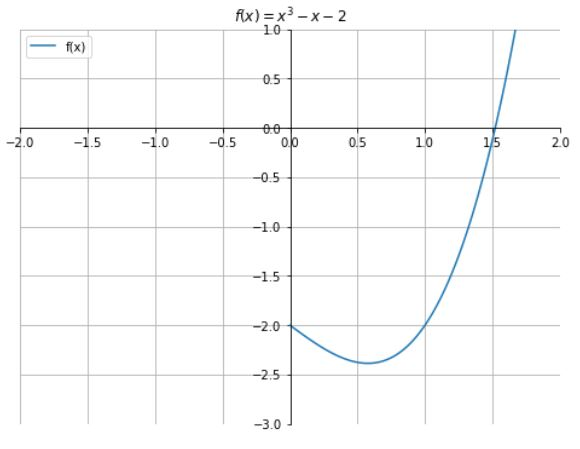
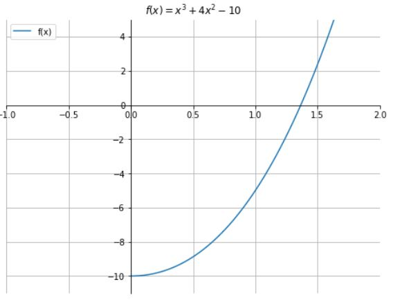
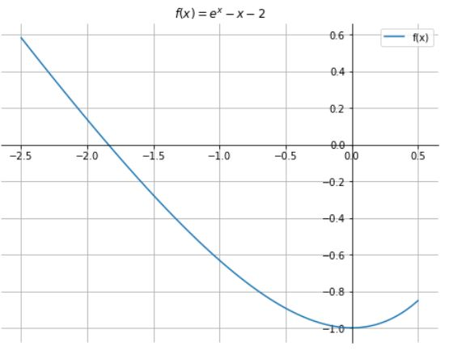

# Método da Bisseção

O método da bisseção é uma técnica numérica simples, robusta e eficiente para determinar raízes de funções contínuas.

> “Seu objetivo é encontrar uma raiz da função f(x) em um intervalo [a, b], tal que f(a) e f(b) tenham sinais opostos.”  
> *(CN_metodo_da_bissecao.pdf)*

---

## Hipóteses

- f é contínua em $[a, b]$
- $f(a)\cdot f(b) < 0$

---

## Entrada (Input)

- Extremos $a$ e $b$
- Tolerância `tol`
- Número máximo de iterações `maxit`

## Saída (Output)

- Aproximação da raiz  
- Ou mensagem de falha

---

# Algoritmo

1. Inicialize $x = a$, $y = b$
2. Defina `iter = 0`
3. Enquanto $y - x > tol$ e `iter < maxit`:
   - $m = \frac{x + y}{2}$
   - Se $f(x)\cdot f(m) < 0$, então $y = m$
   - Se $f(x)\cdot f(m) > 0$, então $x = m$
   - Se $f(m) = 0$, pare: $m$ é raiz exata
   - `iter = iter + 1`
4. Retorne $m$

---

# Vantagens

- Simplicidade
- Convergência garantida
- Estabilidade numérica

# Desvantagens

- Convergência lenta (linear)
- Exige mudança de sinal no intervalo

---

---

# Exemplo 1  
**Aproximar pelo método da Bisseção a raiz de** $f(x) = x^3 - x - 2$ **em** $[1, 2]$ com o criterio de parada $|b_k-a_k| < 10^{-6}$.

## Solução

Para determinar uma raiz da função 
	$f(x)=x^3-x-2$ no intervalo 
	$[1, \; 2]$ pelo método da bisseção, segue-se os seguintes passos: 
	
1. **Intervalo Inicial**: $f(1)=-2$ e $f(2)=4$.
   
   Como $f$ é contínua e $f(1) \cdot f(2)<0$, há uma raiz no intervalo  $[1,  2]$;
		
3. **Ponto Médio**: $pm=\dfrac{1+2}{2}=1.5$, e $f(1.5)=1.5^3-1.5-2=-0.125$;  
		
4. **Novo intervalo**: 	Como $f(1) \cdot f(1.5)>0$, a raiz está em 	$[1.5,  2]$;      
		
5. **Repetição**: Continue repetindo os passos, recalculando o ponto médio e ajustando o intervalo até atingir a precisão desejada.

### Tabela de iterações

| k | a | b | pm | (b - a)/2 | f(pm) |
|---|---|---|----|--------|--------|
| 1 | 1.00000000 | 2.00000000 | 1.50000000 | 0.50000000 | -1.25000000e-01 |
| 2 | 1.50000000 | 2.00000000 | 1.75000000 | 0.25000000 | 1.60937500e+00 |
| 3 | 1.50000000 | 1.75000000 | 1.62500000 | 0.12500000 | 6.66015625e-01 |
| 4 | 1.50000000 | 1.62500000 | 1.56250000 | 0.06250000 | 2.52197266e-01 |
| 5 | 1.50000000 | 1.56250000 | 1.53125000 | 0.03125000 | 5.91125488e-02 |
| 6 | 1.50000000 | 1.53125000 | 1.51562500 | 0.01562500 | -3.40538025e-02 |
| 7 | 1.51562500 | 1.53125000 | 1.52343750 | 0.00781250 | 1.22504234e-02 |
| 8 | 1.51562500 | 1.52343750 | 1.51953125 | 0.00390625 | -1.09712481e-02 |
| 9 | 1.51953125 | 1.52343750 | 1.52148438 | 0.00195312 | 6.22175634e-04 |
| 10 | 1.51953125 | 1.52148438 | 1.52050781 | 0.00097656 | -5.17888647e-03 |
| 11 | 1.52050781 | 1.52148438 | 1.52099609 | 0.00048828 | -2.27944332e-03 |
| 12 | 1.52099609 | 1.52148438 | 1.52124023 | 0.00024414 | -8.28905861e-04 |
| 13 | 1.52124023 | 1.52148438 | 1.52136230 | 0.00012207 | -1.03433124e-04 |
| 14 | 1.52136230 | 1.52148438 | 1.52142334 | 0.00006104 | 2.59354252e-04 |
| 15 | 1.52136230 | 1.52142334 | 1.52139282 | 0.00003052 | 7.79563135e-05 |
| 16 | 1.52136230 | 1.52139282 | 1.52137756 | 0.00001526 | -1.27394677e-05 |
| 17 | 1.52137756 | 1.52139282 | 1.52138519 | 0.00000763 | 3.26081572e-05 |
| 18 | 1.52137756 | 1.52138519 | 1.52138138 | 0.00000381 | 9.93427837e-06 |
| 19 | 1.52137756 | 1.52138138 | 1.52137947 | 0.00000191 | -1.40261126e-06 |
| 20 | 1.52137947 | 1.52138138 | 1.52138042 | 0.00000095 | 4.26582940e-06 |

**Raiz aproximada**: 1.521380

**Iterações**: 20

---

# Exemplo 2  
**Aproximar pelo método da Bisseção a raiz de** $f(x) = x^3 + 4x^2 - 10$ **em** $[1, 2]$ com o criterio de parada $|b_k-a_k| < 10^{-6}$.

## Solução

Pelo método da bisseção, segue-se os seguintes passos:

1. **Intervalo Inicial**: $f(1)=-5$ e $f(2)=14$.
	
	Como $f$ é contínua e $f(1) \cdot f(2)<0$, há uma raiz no intervalo $[1,  2]$;

2. **Ponto Médio**: $pm=\dfrac{1+2}{2}=1.5$, e $f(1.5)=1.5^3+4 \cdot 1.5^2-10=2.375$;

3. **Novo intervalo**: Como $f(1) \cdot f(1.5)<0$, a raiz está em $[1,  1.5]$;

4. **Repetição**: Continue repetindo os passos, recalculando o ponto médio e ajustando o intervalo até atingir a precisão desejada.

### Tabela de iterações

| k | a | b | pm | (b - a)/2 | f(pm) |
|---|---|---|----|--------|--------|
| 1 | 1.00000000 | 2.00000000 | 1.50000000 | 0.50000000 | 2.37500000e+00 |
| 2 | 1.00000000 | 1.50000000 | 1.25000000 | 0.25000000 | -1.79687500e+00 |
| 3 | 1.25000000 | 1.50000000 | 1.37500000 | 0.12500000 | 1.62109375e-01 |
| 4 | 1.25000000 | 1.37500000 | 1.31250000 | 0.06250000 | -8.48388672e-01 |
| 5 | 1.31250000 | 1.37500000 | 1.34375000 | 0.03125000 | -3.50982666e-01 |
| 6 | 1.34375000 | 1.37500000 | 1.35937500 | 0.01562500 | -9.64088440e-02 |
| 7 | 1.35937500 | 1.37500000 | 1.36718750 | 0.00781250 | 3.23557854e-02 |
| 8 | 1.35937500 | 1.36718750 | 1.36328125 | 0.00390625 | -3.21499705e-02 |
| 9 | 1.36328125 | 1.36718750 | 1.36523438 | 0.00195312 | 7.20247626e-05 |
| 10 | 1.36328125 | 1.36523438 | 1.36425781 | 0.00097656 | -1.60466908e-02 |
| 11 | 1.36425781 | 1.36523438 | 1.36474609 | 0.00048828 | -7.98926281e-03 |
| 12 | 1.36474609 | 1.36523438 | 1.36499023 | 0.00024414 | -3.95910152e-03 |
| 13 | 1.36499023 | 1.36523438 | 1.36511230 | 0.00012207 | -1.94365901e-03 |
| 14 | 1.36511230 | 1.36523438 | 1.36517334 | 0.00006104 | -9.35847282e-04 |
| 15 | 1.36517334 | 1.36523438 | 1.36520386 | 0.00003052 | -4.31918799e-04 |
| 16 | 1.36520386 | 1.36523438 | 1.36521912 | 0.00001526 | -1.79948903e-04 |
| 17 | 1.36521912 | 1.36523438 | 1.36522675 | 0.00000763 | -5.39625415e-05 |
| 18 | 1.36522675 | 1.36523438 | 1.36523056 | 0.00000381 | 9.03099274e-06 |
| 19 | 1.36522675 | 1.36523056 | 1.36522865 | 0.00000191 | -2.24658038e-05 |
| 20 | 1.36522865 | 1.36523056 | 1.36522961 | 0.00000095 | -6.71741291e-06 |

**Raiz aproximada**: 1.365229

**Iterações**: 20

---

# Exemplo 3  
**Aproximar pelo método da Bisseção a raiz de** $f(x) = e^x - x - 2$ **em** $[-2,  0]$ com o criterio de parada $|b_k-a_k| < 10^{-6}$.

## Solução

Pelo método da bisseção, segue-se os seguintes passos:

1. **Intervalo Inicial**: $f(-2)=0.1353$ e $f(0)=-1$.
	
	Como $f$ é contínua e $f(-2) \cdot f(0)<0$, há uma raiz no intervalo $[-2, 0]$;

2. **Ponto Médio**: $pm=\dfrac{-2+0}{2}=-1$, e $f(-1)=e^{-1}-(-1)-2=-0.6321$;
   
3. **Novo intervalo**: 
	
	Como $f(-2) \cdot f(-1)<0$, a raiz está em $[-2, -1]$;
   
4. **Repetição**: Continue repetindo os passos, recalculando o ponto médio e ajustando o intervalo até atingir a precisão desejada.

### Tabela de iterações

| k | a | b | pm | (b - a)/2 | f(pm) |
|---|---|---|----|--------|--------|
| 1 | -2.00000000 | 0.00000000 | -1.00000000 | 1.00000000 | -6.32120559e-01 |
| 2 | -2.00000000 | -1.00000000 | -1.50000000 | 0.50000000 | -2.76869840e-01 |
| 3 | -2.00000000 | -1.50000000 | -1.75000000 | 0.25000000 | -7.62260565e-02 |
| 4 | -2.00000000 | -1.75000000 | -1.87500000 | 0.12500000 | 2.83549668e-02 |
| 5 | -1.87500000 | -1.75000000 | -1.81250000 | 0.06250000 | -2.42544875e-02 |
| 6 | -1.87500000 | -1.81250000 | -1.84375000 | 0.03125000 | 1.97297605e-03 |
| 7 | -1.84375000 | -1.81250000 | -1.82812500 | 0.01562500 | -1.11603746e-02 |
| 8 | -1.84375000 | -1.82812500 | -1.83593750 | 0.00781250 | -4.59856577e-03 |
| 9 | -1.84375000 | -1.83593750 | -1.83984375 | 0.00390625 | -1.31400673e-03 |
| 10 | -1.84375000 | -1.83984375 | -1.84179688 | 0.00195312 | 3.29182283e-04 |
| 11 | -1.84179688 | -1.83984375 | -1.84082031 | 0.00097656 | -4.92487892e-04 |
| 12 | -1.84179688 | -1.84082031 | -1.84130859 | 0.00048828 | -8.16717127e-05 |
| 13 | -1.84179688 | -1.84130859 | -1.84155273 | 0.00024414 | 1.23750559e-04 |
| 14 | -1.84155273 | -1.84130859 | -1.84143066 | 0.00012207 | 2.10382416e-05 |
| 15 | -1.84143066 | -1.84130859 | -1.84136963 | 0.00006104 | -3.03170309e-05 |
| 16 | -1.84143066 | -1.84136963 | -1.84140015 | 0.00003052 | -4.63946851e-06 |
| 17 | -1.84143066 | -1.84140015 | -1.84141541 | 0.00001526 | 8.19936810e-06 |
| 18 | -1.84141541 | -1.84140015 | -1.84140778 | 0.00000763 | 1.77994518e-06 |
| 19 | -1.84140778 | -1.84140015 | -1.84140396 | 0.00000381 | -1.42976282e-06 |
| 20 | -1.84140778 | -1.84140396 | -1.84140587 | 0.00000191 | 1.75090895e-07 |
| 21 | -1.84140587 | -1.84140396 | -1.84140491 | 0.00000095 | -6.27336033e-07 |

**Raiz aproximada**: -1.841404914855957

**Iterações**: 21

---

# Exemplo 4  
Aplicando o método da bisseção, determinar a raiz da função $f(x) = cos(x)-x$ no intervalo $[0, \pi/2]$
com uma tolerância de $10^{-6}$.

## Solução

Pelo método da bisseção, segue-se os seguintes passos:

1. **Intervalo Inicial**: $f(0)=1$ e $f(\pi/2)=-1.57079$. 
	
	Como $f$ é contínua e $f(0) \cdot f(\pi/2)<0$, há uma raiz no intervalo $[0,  \pi/2]$;
	
2. **Ponto Médio**: $pm=\dfrac{0+\pi/2}{2}=\frac{\pi}{4}$, e $f(\pi/4)=cos(\pi/4)-\frac{\pi}{4}=-0.07829$;
	
3. **Novo intervalo**: Como $f(0) \cdot f(\pi/4)<0$, a raiz está em $[0,  \pi/4]$;
	
4. **Repetição**: Continue repetindo os passos, recalculando o ponto médio e ajustando o intervalo até atingir a precisão desejada.

### Tabela de iterações

**Raiz aproximada:** **0.7386**

---

# Exemplo 5  
Resolver:

\[
e^x - 2 = \cos(x - 2)
\]

Equivalente a:

\[
f(x) = e^x - \cos(x - 2) - 2
\]

**Raiz aproximada:** **0.8955**

---

# Convergência do Método da Bisseção

O método gera intervalos encaixados:

\[
[a_{k+1}, b_{k+1}] \subset [a_k, b_k]
\]

E:

- \(a_k\) é crescente  
- \(b_k\) é decrescente  
- \(b_k - a_k = \frac{b_0 - a_0}{2^k}\)

Logo:

\[
\lim_{k\to\infty} a_k = \lim_{k\to\infty} b_k = r
\]

E:

\[
f(r) = 0
\]

---

# Ordem de Convergência

Erro:

\[
e_k = |r - c_k|
\]

E:

\[
e_{k+1} \approx \frac{1}{2} e_k
\]

→ Convergência **linear**.

---

# Número de Iterações

Para erro \(e\):

\[
k \ge \log_2\left(\frac{b_0 - a_0}{e}\right)
\]

Exemplo:

\[
k = \log_2\left(\frac{1}{10^{-3}}\right) \approx 9.96 \Rightarrow 10\ \text{iterações}
\]

---

# Exercícios

1. Aplique o método da bisseção para:
   - \(f(x) = x^3 + 4x^2 - 10\)
   - \(f(x) = e^x - x - 2\)
   - \(f(x) = \cos(x) - x\)

2. Calcule o número mínimo de iterações para erro \(10^{-4}\) em \([1, 2]\).

