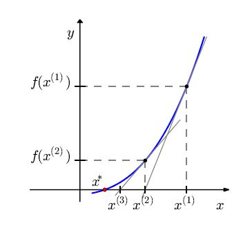

# Método de Newton-Raphson
- O método de Newton, também conhecido como método de Newton-Raphson, é uma eficiente técnica numérica utilizada para encontrar raízes de funções;
	
- Sua eficácia e rapidez o tornam uma ferramenta fundamental em várias áreas da matemática aplicada, engenharia, física e ciência da computação;
	
- O método de Newton é uma abordagem que busca solucionar a equação $f(x)=0$ de forma iterativa, onde $f$ é uma função contínua e diferenciável;
	
- O processo começa com uma estimativa inicial $x_0$ para a raiz e, através de iterações sucessivas, aprimora esta estimativa.

---

## Aspectos Teóricos do Método de Newton
Seja $x^{\star}$ solução de $f(x)=0$, onde $f \in C^1$.

Associamos à determinação do zero de $f$, a iteração de ponto fixo:

$\qquad g(x) = x + \alpha(x)f(x), \quad \alpha(x) \neq 0$,

onde, $\alpha(x)$ é uma função arbitrária.

**Objetivo**: Escolher $\alpha(x)$ de forma que a iteração do ponto fixo tenha ótima taxa de convergência.

"QUANTO MENOR FOR $\mid g'(x) \mid$, A TAXA DE CONVERGÊNCIA SERÁ MAIOR E O ERRO DECAIRÁ MAIS RÁPIDO"

O caso ótimo acontece se, $g'(x^{\star})=0$.

Derivando a função: $g(x) = x + \alpha(x) f(x)$, resulta 

$\qquad g'(x) =1+\alpha(x) f'(x) + \alpha'(x) f(x)$.

No ponto $x=x^{\star}$, temos:

$\qquad g'(x^{\star}) = 1 + \alpha(x^*) f'(x^{\star}) + \alpha'(x^{\star}) \underbrace{f(x^{\star})}_{=0}$.

Como $f(x^{\star})=0$, temos:

$\qquad g'(x^{\star}) = 1 + \alpha(x^{\star}) f'(x^{\star})$.

escolhendo: $g'(x^{\star})=0$, resulta:

$\qquad \alpha(x^{\star}) = -\dfrac{1}{f'(x^{\star})}, \qquad f'(x^{\star})\neq 0$.

Logo,

$\qquad g(x) = x + \alpha(x) f(x) = x - \dfrac{f(x)}{f'(x)}$.

Do método iterativo do ponto fixo: $x_{n+1}=g(x_n)$, obtém-se o **método de Newton** para calcular os zeros de $f$:

$\qquad \boxed{x_{n+1} = x_{n} - \dfrac{f\left(x_n \right)}{f'\left(x_{n}\right)}, \quad n\geq 0,}$

sendo $x_0$ uma aproximação inicial dada.

---

### Interpretação Geométrica

Geometricamente, o ponto $x_{n+1}$ é a interseção da reta tangente ao gráfico da função $f(x)$ no ponto $x=x_n$ com o eixo das abscissas.

Com efeito, a equação da reta que passa pelo ponto $(x_n, \; f(x_n))$ é:

$\qquad y = f'(x_n)(x - x_n) + f(x_n)$. 

Assim, a interseção desta reta com o eixo das abscissas $y=0$ é:

$\qquad f'(x_n)(x - x_n) + f(x_n) = 0$

e portanto,

$\qquad x = x_n - \dfrac{f(x_n)}{f'(x_n)}$

com $x=x_{n+1}$.

---

## Convergência
Pelo teorema do ponto fixo o Método de Newton é convergente numa vizinhança do zero da função. E esta convergência é pelo menos linear.

Por construção, a taxa de convergência é ótima!!!!

Qual é esta taxa de convergência?

A série de Taylor em torno de $x=x^{\star}$:

$\qquad g(x)=\underbrace{g(x^{\star})}\_{= x^{\star}} + \underbrace{g'( x^{\star})}\_{=0} (x-x^{\star}) + \dfrac{g^{''} (x^{\star})}{2} (x-x^{\star})^2 + O((x-x^{\star} )^3 )$

como $g(x^{\star}) = x^{\star}, \quad g'(x^{\star})=0$ e considerando $x=x_n$, temos:

$\qquad \underbrace{g(x_n)}\_{x_{n+1}} = x^{\star} + \dfrac{g^{''} (x^{\star}) }{2}(x_n-x^{\star})^2 + O((x_n - x^{\star} )^3)$; 

Com isso, temos:

$\qquad x_{n+1} = g(x_n) =  x^{\star}+ \dfrac{g^{''}(x^{\star})}{2}(x_n-x^{\star})^2 + O((x_n-x^{\star})^3)$,

Logo,

$\qquad \underbrace{ \mid x_{n+1}-x^{\star} \mid }\_{e_{n+1}} \leq  \ C \ \underbrace{ \mid x_n-x^{\star} \mid^2 }\_{e_n^2}$,

portanto, $e_{n+1} \leq C \cdot e_n^2$ com constante $C = \mid g''(x^*)/2 \mid$.

Isto é, o método de Newton tem **taxa de convergência quadrática**.

---

