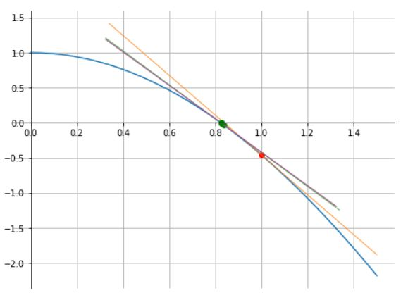
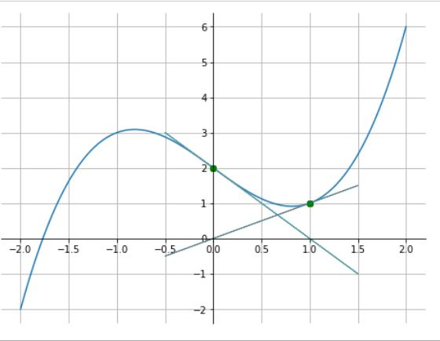
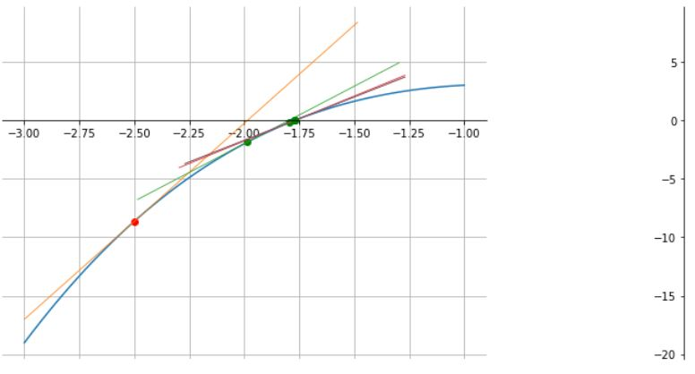
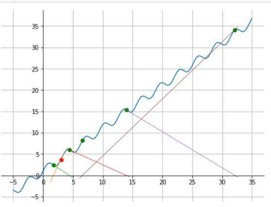
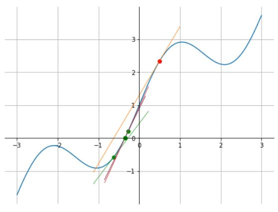

# Método de Newton-Raphson
- O método de Newton, também conhecido como método de Newton-Raphson, é uma eficiente técnica numérica utilizada para encontrar raízes de funções;
	
- Sua eficácia e rapidez o tornam uma ferramenta fundamental em várias áreas da matemática aplicada, engenharia, física e ciência da computação;
	
- O método de Newton é uma abordagem que busca solucionar a equação $f(x)=0$ de forma iterativa, onde $f$ é uma função contínua e diferenciável;
	
- O processo começa com uma estimativa inicial $x_0$ para a raiz e, através de iterações sucessivas, aprimora esta estimativa.

---

## Aspectos Teóricos do Método de Newton
Seja $x^{\star}$ solução de $f(x)=0$, onde $f \in C^1$.

Associamos à determinação do zero de $f$, a iteração de ponto fixo:

$\qquad g(x) = x + \alpha(x)f(x), \quad \alpha(x) \neq 0$,

onde, $\alpha(x)$ é uma função arbitrária.

**Objetivo**: Escolher $\alpha(x)$ de forma que a iteração do ponto fixo tenha ótima taxa de convergência.

"QUANTO MENOR FOR $\mid g'(x) \mid$, A TAXA DE CONVERGÊNCIA SERÁ MAIOR E O ERRO DECAIRÁ MAIS RÁPIDO"

O caso ótimo acontece se, $g'(x^{\star})=0$.

Derivando a função: $g(x) = x + \alpha(x) f(x)$, resulta 

$\qquad g'(x) =1+\alpha(x) f'(x) + \alpha'(x) f(x)$.

No ponto $x=x^{\star}$, temos:

$\qquad g'(x^{\star}) = 1 + \alpha(x^*) f'(x^{\star}) + \alpha'(x^{\star}) \underbrace{f(x^{\star})}_{=0}$.

Como $f(x^{\star})=0$, temos:

$\qquad g'(x^{\star}) = 1 + \alpha(x^{\star}) f'(x^{\star})$.

escolhendo: $g'(x^{\star})=0$, resulta:

$\qquad \alpha(x^{\star}) = -\dfrac{1}{f'(x^{\star})}, \qquad f'(x^{\star})\neq 0$.

Logo,

$\qquad g(x) = x + \alpha(x) f(x) = x - \dfrac{f(x)}{f'(x)}$.

Do método iterativo do ponto fixo: $x_{n+1}=g(x_n)$, obtém-se o **método de Newton** para calcular os zeros de $f$:

$\qquad \boxed{x_{n+1} = x_{n} - \dfrac{f\left(x_n \right)}{f'\left(x_{n}\right)}, \quad n\geq 0,}$

sendo $x_0$ uma aproximação inicial dada.

---

### Interpretação Geométrica

Geometricamente, o ponto $x_{n+1}$ é a interseção da reta tangente ao gráfico da função $f(x)$ no ponto $x=x_n$ com o eixo das abscissas.

Com efeito, a equação da reta que passa pelo ponto $(x_n, \; f(x_n))$ é:

$\qquad y = f'(x_n)(x - x_n) + f(x_n)$. 

Assim, a interseção desta reta com o eixo das abscissas $y=0$ é:

$\qquad f'(x_n)(x - x_n) + f(x_n) = 0$

e portanto,

$\qquad x = x_n - \dfrac{f(x_n)}{f'(x_n)}$

com $x=x_{n+1}$.

---

## Convergência
Pelo teorema do ponto fixo o Método de Newton é convergente numa vizinhança do zero da função. E esta convergência é pelo menos linear.

Por construção, a taxa de convergência é ótima!!!!

Qual é esta taxa de convergência?

A série de Taylor em torno de $x=x^{\star}$:

$\qquad g(x)=\underbrace{g(x^{\star})}\_{= x^{\star}} + \underbrace{g'( x^{\star})}\_{=0} (x-x^{\star}) + \dfrac{g^{''} (x^{\star})}{2} (x-x^{\star})^2 + O((x-x^{\star} )^3 )$

como $g(x^{\star}) = x^{\star}, \quad g'(x^{\star})=0$ e considerando $x=x_n$, temos:

$\qquad \underbrace{g(x_n)}\_{x_{n+1}} = x^{\star} + \dfrac{g^{''} (x^{\star}) }{2}(x_n-x^{\star})^2 + O((x_n - x^{\star} )^3)$; 

Com isso, temos:

$\qquad x_{n+1} = g(x_n) =  x^{\star}+ \dfrac{g^{''}(x^{\star})}{2}(x_n-x^{\star})^2 + O((x_n-x^{\star})^3)$,

Logo,

$\qquad \underbrace{ \mid x_{n+1}-x^{\star} \mid }\_{e_{n+1}} \leq  \ C \ \underbrace{ \mid x_n-x^{\star} \mid^2 }\_{e_n^2}$,

portanto, $e_{n+1} \leq C \cdot e_n^2$ com constante $C = \mid g^{''}(x^*)/2 \mid$.

Isto é, o método de Newton tem **taxa de convergência quadrática**.

---

<b>Exemplo</b>

Encontre a raiz positiva da função 
	
$\qquad f(x)=cos(x)-x^2$
	
pelo método de Newton inicializando-o com $x_0=1$, e uma tolerância de $10^{-6}$.

<b>Solução</b>

Temos:
	
$\qquad f(x) = cos(x) - x^2$

$\qquad f'(x) = -sen(x) - 2x$

logo, tem-se o método iterativo de Newton:

$x_{n+1} =  x_n - \dfrac{f(x_n)}{f'(x_n)} = x_n - \dfrac{cos(x_n)-x_n^2}{-sen(x_n)-2x_n}$

$x_0 = 1$

**Resultado** com tolerância de $10^{-6}$:
	
|$i$ | $x_i$ | $f(x_i)$|
|--|--|--|
|0 | 1.000000 | -0.45969769413186023|
|1 | 0.838218 | -0.03382168804094854|
|2 | 0.824241 | -0.0002610027576273044|
|3 | 0.824132 | -1.6076211473148305e-08|
|4 | 0.824132 | -2.220446049250313e-16|

portanto, raiz = 0.824132 e f(raiz) = -1.6076211473148305e-08.

---

<b>Exemplo</b>

Considere o método de Newton para encontrar a raiz de 

$\qquad f(x)=x^3-2x+2$.

a) O que acontece quando $x_0=0$?
	
b) Escolha um valor adequado para inicializar o método e obter a única raiz real desta equação.

<b>Solução do item a)</b>

Temos 
	
$\qquad f(x) = x^3-2x+2$

$\qquad f'(x) = 3x^2-2$

$\qquad x_{n+1} = x_n - \dfrac{f(x_n)}{f'(x_n)} = x_n - \dfrac{x_n^3-2x_n+2}{3x_n^2-2}$

$\qquad x_0 = 0$
	
**Resultados** com tolerância de $10^{-6}$:
	
|$i$ | 0 | 1 | 2 |3 |4 | 5|
|--|--|--|--|--|--|--|
|$x_i$ | 0 | 1 | 0 | 1 | 0 | 1|
|$f(x_i)$ | 2 | 1 | 2 | 1 | 2 | 1| 

Comportamento oscilatório!!! Não convergente!!!
	
Como $f^{''}(x)=6x$ tem-se que $f''(0)=0$, portanto, $x_0=0$ é ponto de inflexão de $f$.

<b>Solução do item b)</b>

Considerando $x_0=-2.5$, obtém-se convergência como mostra a seguinte tabela:

|$i$ | $x_i$ | $f(x_i)$|
|--|--|--|
|0 | -2.50000 | -8.625|
|1 | -1.98507 | -1.8520795443588471|
|2 | -1.7965 | -0.20506033402315094|
|3 | -1.76981 | -0.0038210113695398285|
|4 | -1.76929 | -1.4167370148143732e-06|
|5 | -1.76929 | -1.949551631241775e-13|

raiz = -1.76929.
	
f(raiz) = -1.949551631241775e-13.

---

<b>Exemplo</b>

Considere o método de Newton para encontrar a raiz de 

$\qquad f(x)=x+sen(2x)+1$;

a) O que acontece quando $x_0=3$?

b) Escolha um valor adequado para inicializar o método e obter a única raiz real desta equação.

<b>Solução do item a)</b>

$\qquad f(x) = x + sen(2x) + 1$

$\qquad	f'(x) = 1+2cos(2x)$

$\qquad	x_{n+1} = x_n - \dfrac{f(x_n)}{f'(x_n)} = x_n - \dfrac{x_n + sen(2x_n)+1}{1+2cos(2x_n)}$

$\qquad x_0 = 3$

**Resultados** com tolerâcia $10^{-6}$:

|$i$ | $x_i$ | $f(x_i)$|
|--|--|--|
|0 | 3 | 3.720584501801074|
|1 | 1.72598 | 2.4205753276617523|
|2 | 4.40228 | 5.983494353730372|
|3 | 13.93777 | 15.32607391512783|
|4 | 32.11675 | 34.10247448437865|
|5 | 6.60429 | 8.20326897230026|

- Problemas na convergência!!!;

- A função $f$ tem um máximo em $x=\pi/3 \approx 1,04$ e um mínimo em $x=2 \pi/3 \approx 2,09$;

- A condição inicial está à direita do mínimo e a raiz esta a esquerda do máximo, e portanto pode aparecer uma divisão por zero criando uma condição de overflow.

<b>Solução b)</b>

Considerando a condição inicial $x_0=0,5$, resulta:

|$i$ | $x_i$ | $f(x_i)$|
|--|--|--|
|0 | 0.5 | 2.3414709848078967|
|1 | -0.62538 | 0.5746041209135029|
|2 | -0.27269 | 0.20856835228937398|
|3 | -0.34966 | 0.006652864696707672|
|4 | -0.35228 | 8.916430764838168e-06|
|5 | -0.35228 | 1.6169066086035855e-11|

raiz = -0.35228.

f(raiz) = 1.6169066086035855e-11

---

