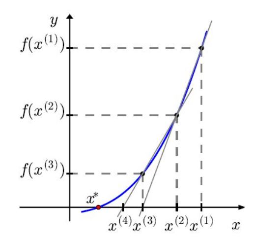
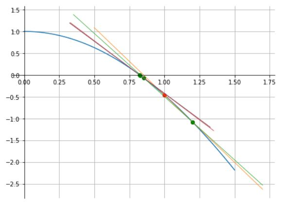
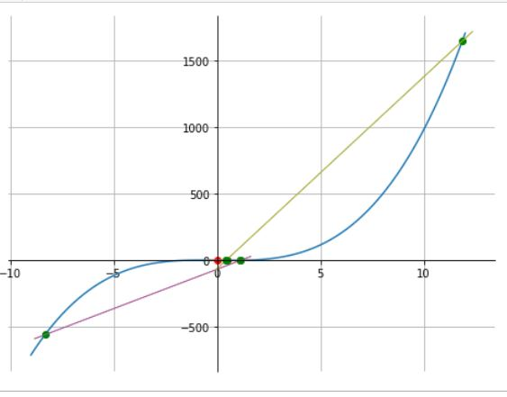
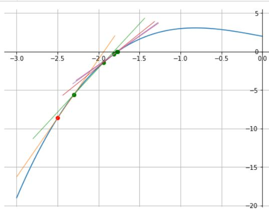
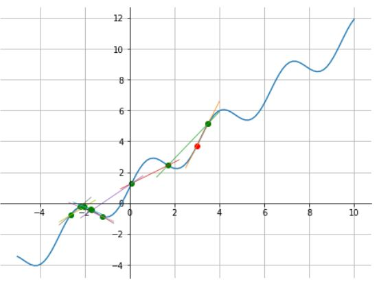
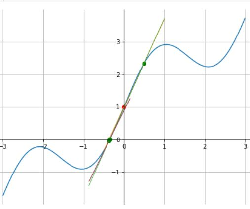

# Método da Secante

- O método da secante é um procedimento iterativo utilizado para encontrar zeros de uma função $f(x)$;
	
- Ele pertence à categoria dos métodos numéricos e é particularmente útil quando se busca uma solução aproximada para a equação $f(x)=0$;
	
- Este método é uma alternativa aos métodos de Newton e da bisseção, combinando algumas vantagens de ambos; onde $f$ é uma função contínua e diferenciável.
	
- O processo começa com duas  estimativas iniciais $x_0$ e $x_1$ para a raiz, e através de iterações sucessivas, aprimora esta estimativa.

---

## Dedução do Método da Secante

Se no método de Newton,

$\qquad x_{n+1} = x_n - \dfrac{f(x_n)}{f'(x_n)}. \quad n \geq 0$

aproximamos $f'(x_n)$, por:

$\qquad f'(x_n)  \approx \dfrac{f(x_n)-f(x_{n-1})}{x_n-x_{n-1}}$

obtemos a iteração do método da Secante:

$\qquad \boxed{ x_{n+1} = x_n - f(x_n) \cdot \left( \dfrac{x_n - x_{n-1}}{f(x_n) - f(x_{n-1})} \right),\quad n\geq 1 }$

com condições iniciais $x_0$ e $x_1$.

---

<b>Passos do Método da Secante</b>

1. Escolha dos Pontos Iniciais:
	
	- Selecione dois pontos iniciais $x_0$ e $x_1$ próximos da raiz desejada.  É importante que $f(x_0)$ e $f(x_1)$ não sejam iguais para evitar divisão por zero.

	
2. Iteração:
	
	- Calcule a próxima aproximação $x_{n+1}$ usando a fórmula: 
	
$\qquad \qquad x_{n+1} = x_n - f(x_n) \cdot \left( \dfrac{x_n -  x_{n-1}}{f(x_n) - f(x_{n-1})} \right),\quad n\geq 1$
		
$\qquad \qquad$ com condições iniciais $x_0$ e $x_1$.	
	 
3. Repetição:

	- Continue iterando até que a diferença entre os valores sucessivos $x_n$ e $x_{n+1}$ seja menor que uma tolerância predefinida, ou até que $f(x_{n+1})$ esteja suficientemente próximo de zero.

---

<b>Interpretação geométrica</b>

- O método de Newton está relacionado às retas tangentes ao gráfico da função  $f$;
	
- O método das secantes, está relacionado às retas secantes da função $f$.

---

## Convergência do método da secante

<b>Teorema</b>

Para condições iniciais suficientemente próximas de $x^{\star}$, onde $f(x^{\star})=0$, temos:

$\qquad \mid x_{n+1} - x^{\star} \mid   \leq C \cdot \mid x_n - x^{\star} \mid^{p}$

onde, 

$\qquad p=\dfrac{\sqrt{5}+1}{2}\approx 1.618$.

Ou seja, o método da secante tem  **taxa de convergência superlinear**.

---

<b>Vantagens</b>

- **Não Requer Derivada**: Como não depende do cálculo da derivada de $f$, é aplicável a uma maior variedade de funções;

- **Rapidez**: Pode convergir mais rapidamente do que métodos como a bisseção, especialmente quando se está próximo da raiz.

<b>Desvantagens</b>

- **Convergência**: A convergência não é garantida; pode ser lenta ou não convergir se os pontos iniciais não forem bem escolhidos;

- **Complexidade**: É mais complexo que o método da bisseção e pode ser menos estável que o método de Newton-Raphson.

---

<b>Exemplo</b>

Aproxime a raiz positiva da função 

$\qquad f(x)=cos(x)-x^2$

pelo método da secante inicializando-o com $x_0=1$ e $x_1=1.2$ e uma tolerância de $10^{-6}$.	

<b>Solução</b>

Aplica-se o método da secante à função $f(x)=cos(x)-x^2$:

1. Escolha dos Pontos Iniciais:
	
	- Selecione os pontos iniciais $x_0=1$ e $x_1=1.2$;
	
2. Iteração:
	
	- Aplicamos o processo iterativo:
	
$\qquad \qquad x_{n+1} = x_n - f(x_n) \cdot \left( \dfrac{x_n - x_{n-1}}{f(x_n) - f(x_{n-1})} \right),\quad n\geq 1$
		
$\qquad \qquad$ com condições iniciais $x_0$ e $x_1$.
	
3. Repetição:
	
	- Continuar iterando até que a diferença entre os valores sucessivos $x_n$ e $x_{n+1}$ seja menor que uma tolerância predefinida, ou até que $f(x_{n+1})$ esteja suficientemente próximo de zero.
	
**Resultado**

|$i$ | $x_i$ | $f(x_i)$|
|--|--|--|
|0 | 1.000000 | -0.45969769413186023|
|1 | 1.200000 | -1.0776422455233263|
|2 | 0.8512171705060823 | -0.06550245048833103|
|3 | 0.8286450612656631 | -1.6076211473148305e-08|
|4 | 0.8241996513418717 | -0.010777645484904674|
|5 | 0.8241324826757257 | -0.00016042270666027925|
|6 | 0.8241323123089737 | -4.058670627360428e-07|

raiz = 0.82413 com 6 iterações (maior que Newton com 4 iterações);

f(raiz) = -4.058670627360428e-07.

---

<b>Exemplo</b>

Considere o método da secante para aproximar a raiz de 

$\qquad f(x)=x^3-2x+2$.

a) O que acontece quando $x_0=0$ e $x_1=0,5$?
	
b) Escolha  valores adequado para inicializar o método e obter a única raiz real desta equação.

<b>Solução de a)</b>

Consideremos $x_0=0$ e $x_1=0.5$:

|$i$ | $x_i$ | $f(x_i)$|
|--|--|--|
|0 | 0.000000	| 2.000000| 
|1 | 0.500000 	| 1.125000|
|2 | 1.142857	| 1.206997|
|3 | -8.320000	|-557.290368|
|$\vdots$ | $\vdots$ | $\vdots$|
|76 | -1.769046 |	0.001823|
|77 | -1.769291 | 0.000008|
|78 | -1.769292 | -0.000000|

raiz = -1.76929 com 76 iterações (perda de convergência superlinear);

existe um máximo entre os valores iniciais e a raiz.

<b>Solução de b)</b>

Considerando $x_0=-2.5$ e $x_1=-2.3$:

|$i$ | $x_i$ | $f(x_i)$|
|--|--|--|
|0 | -2.50000 |-8.625|
|1 | -2.300000 |-5.567| 
|2 | -1.935906 | -1.383443| 
|3 | -1.815505 | -0.353001|
|4 | -1.774259 | -0.036841|
|5 | -1.769453 | -0.001186|
|6 | -1.769293 | -0.000004|
|7 | -1.769292 | -0.000000|

raiz = -1.76929 com 6 iterações.

---

<b>Exemplo</b>

Considere o método da secante para encontrar a raiz de 

$\qquad f(x)=x+sen(2x)+1$;

a) O que acontece quando $x_0=3,0$ e $x_1=3,5$?
	
b) Escolha um valor adequado para inicializar o método e obter a única raiz real desta equação.

<b>Solução de a)</b>

Consideremos $x_0=3$ e $x_1=3.5$:

|$i$ | $x_i$ | $f(x_i)$|
|--|--|--|
|0 | 3.000000	| 3.720585|
|1 | 3.500000	| 5.156987|
|2 | 1.704895	| 2.439902|
|$\vdots$ | $\vdots$ | $\vdots$| 
|22 | -0.352190 | 0.000249|
|23 | -0.352289 |-0.000000|
|24 |-0.352288  | -0.000000|

raiz = -0.35228 com 23 iterações; 

A condição inicial está à direita do mínimo e a raiz esta a esquerda do máximo, entretanto atinge a convergência em 23 iterações.

<b>Solução de b)</b>

Consideremos $x_0=-2.5$ e $x_1=-2.3$:

|$i$ | $x_i$ | $f(x_i)$| 
|--|--|--|
|0 | 0.000000	| 1.000000|
|1 | 0.500000	| 2.34147|
|2 | -0.372725 |-0.051028|
|3 | -0.354111 | -0.004596|
|4 | -0.352269 | 0.000050|
|5 | -0.352288 | -0.000000|
|6 | -0.352288 | -0.000000|

raiz = -0.35228 com 5 iterações.

---

## Método da secante e raízes múltiplas
Considere uma função com raiz de multiplicidade $m$:

$\qquad f(x) = (x - \alpha)^m g(x), \qquad g(\alpha) \neq 0$.

O método da secante é dado por:

$\qquad x_{n+1} = x_n - f(x_n) \ \dfrac{x_n - x_{n-1}}{f(x_n) - f(x_{n-1})}$.

Quando a raiz é simples ($m = 1$), o método da secante possui convergência superlinear, com ordem

$\qquad p = \dfrac{1+\sqrt{5}}{2} \approx 1.618$.

Entretanto, quando a raiz tem multiplicidade $m \ge 2$, a convergência se deteriora para \textbf{linear}. Mais precisamente, o erro satisfaz

$\qquad e_{n+1} \approx \left(1 - \dfrac{1}{m}\right) e_n$,

onde $e_n = x_n - \alpha$.

No caso de uma raiz dupla ($m = 2$), temos:

$\qquad e_{n+1} \approx \frac{1}{2} e_n$,

isto é, convergência linear com razão $\dfrac{1}{2}$.

Portanto, assim como o método de Newton clássico, o método da secante perde sua convergência acelerada quando a raiz é múltipla.
