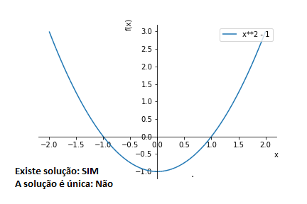

# Método de Iteração do Ponto Fixo

## Definição
$p$ é um ponto fixo da função $g$, se e somente se, $g(p)=p$.

## Observação

- Geometricamente, um ponto fixo de uma função é um ponto de intersecção entre a reta $y=x$ com o gráfico da função $g(x)$.

  
	
- O problema de achar um zero: $f(p)=0$, pode-se transformar num problema de ponto fixo: $g(p)=p$, definindo a função $g$ de várias formas.
	
  Por exemplo, se $g(x)=x - \alpha f(x)$:
  
$$
	f(p)=0 \Rightarrow g(p)=p - \alpha f(p)=p - \alpha \cdot 0=p,
$$

$\qquad$ portanto, $g(p)=p$.
		
- Reciprocamente, o problema de ponto fixo: $g(p)=p$, pode-se transformar num problema de achar um zero fazendo $f(x)=g(x)-x$:

$$
  g(p)=p \Rightarrow f(p)=g(p) - p =p - p =0,
$$
  
$\qquad$ portanto, $f(p)=0$.		

---

## Exemplo
Determine se a função $g(x)=x^2-2$ tem um ponto fixo.

### Solução
Deve-se resolver: $\color{white}{g(x)=x}$:

$$
\begin{aligned}[rl]
	 g(x) = x& \\
	 x^2-2 = x& \\
	 x^2-x-2 = 0& \\
	 (x+1) \cdot (x-2) = 0&
\end{aligned}
$$

Logo, os pontos fixos de $g$ são: $x=-1$ e $x=2$.

Geometricamente os pontos fixos $x=-1$ e  $x=2$ são as interseções do gráfico de $g(x)=x^2-2$ e a reta $y=x$.

