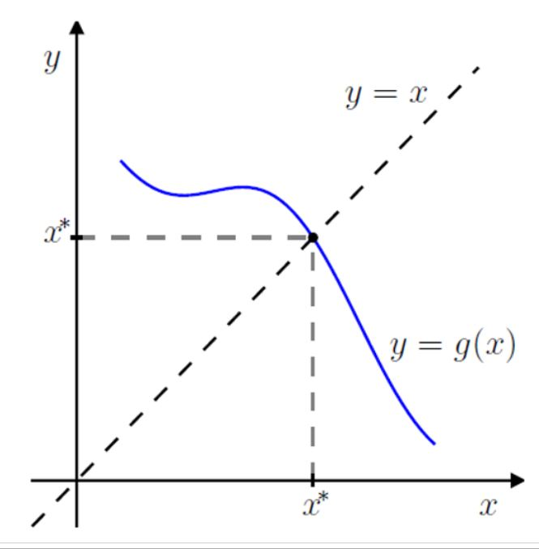
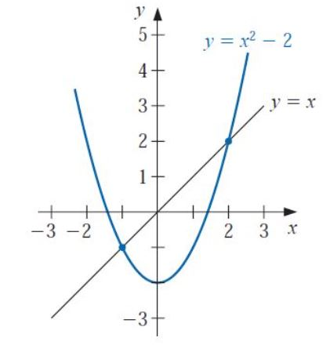
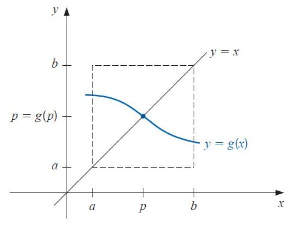
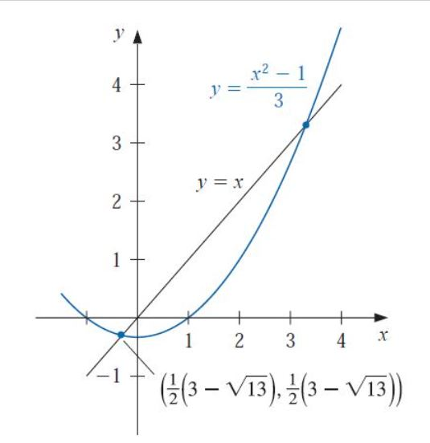
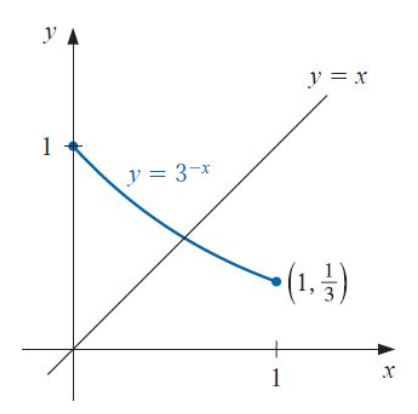
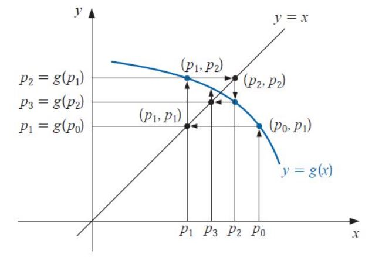
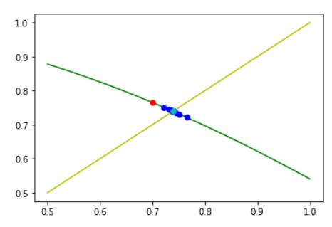
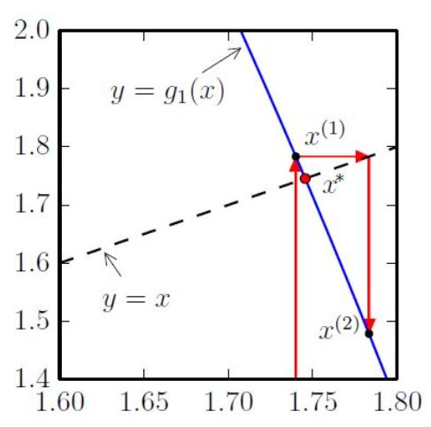
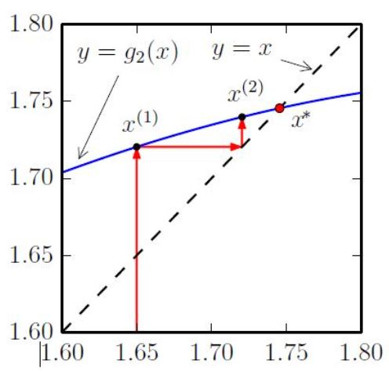

# Método de Iteração do Ponto Fixo

## Definição
$p$ é um ponto fixo da função $g$, se e somente se, $g(p)=p$.

## Observação

- Geometricamente, um ponto fixo de uma função é um ponto de intersecção entre a reta $y=x$ com o gráfico da função $g(x)$.

  
	
- O problema de achar um zero: $f(p)=0$, pode-se transformar num problema de ponto fixo: $g(p)=p$, definindo a função $g$ de várias formas.
	
  Por exemplo, se $g(x)=x - \alpha f(x)$:
  
$\qquad f(p)=0 \Rightarrow g(p)=p - \alpha f(p)=p - \alpha \cdot 0=p,$

$\qquad$ portanto, $g(p)=p$.
		
- Reciprocamente, o problema de ponto fixo: $g(p)=p$, pode-se transformar num problema de achar um zero fazendo $f(x)=g(x)-x$:

$g(p)=p \Rightarrow f(p)=g(p) - p =p - p =0,$
  
$\qquad$ portanto, $f(p)=0$.		

---

## Exemplo
Determine se a função $g(x)=x^2-2$ tem um ponto fixo.

### Solução
Deve-se resolver: $\color{white}{g(x)=x}$:

$g(x) = x$

$x^2-2 = x$

$x^2-x-2 = 0$

$(x+1) \cdot (x-2) = 0$

Logo, os pontos fixos de $g$ são: $x=-1$ e $x=2$.

Geometricamente os pontos fixos $x=-1$ e  $x=2$ são as interseções do gráfico de $g(x)=x^2-2$ e a reta $y=x$.

---

<b>Teorema (Existência e Unicidade)</b> 

1. Se $g \in C^0[a, \ b]$ e $g(x) \in [a, \ b]$, então $g$ admite um ponto fixo em $[a, \ b]$;

2. Se além mais, $g \in C^1 (a, \ b)$ e existe uma constante $0<k<1$ tal que
   
$\qquad$ $\mid g'(x) \mid \leq k, \ \forall x \in (a, \ b)$,

$\qquad$ então existe um único ponto fixo em $[a, \ b]$.

<b>Demonstração</b>

<b>Prova da existência:</b>

- Se $g(a)=a$ ou $g(b)=b$, então $a$ ou $b$ é um ponto fixo;
			
- Se $a<g(x)<b$, seja $f(x)=g(x)-x$, temos:
	
	- $f(a)=g(a)-a>0$, e	
				
	- $f(b)=g(b)-b<0$,
				
	- pelo teorema de Bolzano, existe $p$ tal que $f(p)=0$;
				
	- logo, $f(p)=g(p)-p=0$ e portanto, $g(p)=p$.
			
<b>Prova da unicidade:</b>
		
Por contradição: vamos supor que $p$ e $q$ são dois pontos fixos diferentes, logo:
		
- pelo TVM, existe $r \in [p, \ q]$, tal que $\dfrac{g(q)-g(p)}{q-p}=g^{'}(r)$;
		
- $\mid q-p \mid = \mid g(q)-g(p) \mid = \mid g^{'}(r) \mid \ \mid q-p \mid \leq k \mid q-p \mid < \mid q-p \mid$;
		
- portanto, $\mid q-p \mid < \mid q-p \mid$, o qual é uma contradição.
		
Conclui-se que existe um único ponto fixo em $[a, \ b]$.

---

<b>Exemplo</b>

Verificar que $g(x)=\dfrac{x^2-1}{3}$ tem um único ponto fixo em $[-1, \; 1]$.

<b> Solução </b>

- $g \in C^0 [-1, \ 1]$;
	
- se $-1 \leq x \leq 1$, então
  
$\qquad 0 \leq x^2 \leq 1 \Rightarrow -\dfrac{1}{3} \leq \dfrac{x^2-1}{3} \leq 0 \quad \Rightarrow \quad g(x) \subset [-1, \ 1]$
		
- se $x \in [-1, \ 1]$, então
  
$\qquad \mid g^{'}(x) \mid = \dfrac{2 \mid x \mid }{3} \leq \dfrac{2}{3} = k < 1$

Logo, $g$ admite um único ponto fixo em $[-1, \ 1]$.

<b>Cálculo dos pontos fixos</b>.

$\qquad g(x) = x \; \Rightarrow \dfrac{x^2-1}{3} = x \quad \Rightarrow \quad x^2-3x-1=0$

$\qquad x = \dfrac{-(-3) \pm \sqrt{(-3)^2-4(1)(-1)}}{2 \cdot 1} = \dfrac{3 \pm \sqrt{13}}{2}$
	
logo, os pontos fixos são
	
$\qquad p_1 = \dfrac{3-\sqrt{13}}{2} \in [-1, \ 1]$

$\qquad p_2 = \dfrac{3+\sqrt{13}}{2} \notin [-1, \ 1]$
	
portanto, $g$ admite um único ponto fixo no intervalo $[-1, \ 1]$.

---

<b> Observação </b>
	
- Considerando $g(x)=(x^2-1)/3$ no intervalo $[3, \ 4]$, temos o ponto fixo $p_2 = (3+\sqrt{13})/2$;
	
- temos que $p_2 \in [3, \ 4]$, mas $g([3, \ 4]) \not\subset [3, \ 4]$, por exemplo $g(4)=5 \notin [3, \ 4]$;
	
- assim, $p_2$ é um ponto fixo de $g$, entretanto não satisfaz as condições do Teorema.

O Teorema da condições suficientes, mas não necessárias.

---

<b> Exemplo </b>

Mostre que o teorema não garante a unicidade de um ponto fixo de $g(x)=3^{-x}$ em $[0, \ 1]$, ainda que exista um único ponto fixo nesse intervalo.

<b>Solução</b>

- $g \in C^0[0, \; 1]$;
	
- $g'(x) = -3^{-x} \cdot ln(3) < 0$, logo $g$ é estritamente decrescente;
	
- como $0<g(x)<g(0)=1$, então $g([0, \ 1]) \subset [0, \ 1]$. O teorema garante a existência de um ponto fixo de $g$ em $[0, \ 1]$;
	
- como $g'(0)=-ln(3)<-1$, então $\mid g'(x) \mid \nless 1$ em $[0, \ 1]$.

O teorema não garante a unicidade. Entretanto o gráfico mostra a existência de um único ponto fixo de $g$ em $[0, \ 1]$.

<b> Observação</b>

Como determinar o ponto fixo de $g(x)=3^{-x}$ no intervalo $[0, \ 1]$?

- como a função $g$ é contínua em $[0, \ 1]$ pode-se aplicar o método da bisseção para $f(x)=g(x)-x$;
	
- ou, desenvolver métodos numéricos para aproximar os pontos fixos. !!!

---

# Método da iteração do Ponto Fixo

<b> Problema:</b>

Dada uma função $g(x)$ desejamos resolver a equação $x=g(x)$.
	
O **método da iteração do ponto fixo** consiste em computar a seguinte sequência recursiva:
	
$\qquad x_{n+1} = g(x_n), \quad n>0$
	
com $x_0$ sendo uma aproximação inicial do ponto fixo.

---

<b> Exemplo</b>

Aplicando o método de iteração do ponto fixo, determinar o zero da função $f(x)=xe^x - 10$.

<b> Solução</b>

- Construindo um problema de ponto fixo equivalente:
		
$\qquad f(x)=0 \Rightarrow \alpha f(x)=0 \Rightarrow x- \alpha f(x) =x,$
		
$\qquad$ para qualquer parâmetro $\alpha \neq 0$.
	
- Consideremos, então, as seguintes duas funções:
		
$\qquad g_1(x) = x-0.5 f(x)$, e

$\qquad g_2(x) = x-0.05 f(x)$.
		
- O ponto fixo destas duas funções coincide com o zero de $f(x)$, pois se $g(p)=p$ então:
		
$\qquad g_1(p) = p-0.5f(p) \quad \Rightarrow \quad  p=p-0.5 f(p) \quad \Rightarrow \quad  f(p)=0$, e

$\qquad g_2(p) = p-0.05 f(p) \quad \Rightarrow \quad  p=p-0.05f(p) \quad \Rightarrow \quad f(p)=0$.
		
- Construindo as iterações do ponto fixo:

$\qquad x_{n+1} = g_1(x_n) = x_n - 0.5 f(x_n)$

$\qquad x_0 = 1.7 $

$\qquad$ e

$\qquad z_{n+1} = g_2(z_n) = z_n - 0.05 f(x_n)$

$\qquad z_0 = 1.7$
		
obtém-se a seguinte tabela com os resultados:
		
|$n$ | $x_n$ | $z_n$ |
|--|--|--| 
|0 | 1.700 | 1.700|
|1 | 2.047 | 1.735| 
|2 | -0.8812 | 1.743| 
|3 | 4.3013 | 1.746| 
|4 | -149.4 | 1.746| 

A sequência $x_n$ é divergente, enquanto a sequência $z_n$ é convergente.

---

<b>Observação</b>

Em geral, deve-se responder às seguintes questões:

- Será que a iteração do ponto fixo é convergente?
	
- Caso seja convergente, será que o limite da sequência $x^* = \lim\limits_{n\to \infty }x_{n}$ é um ponto fixo?
		
$\qquad$ A resposta é na afirmativa:
	
$\qquad x^* = \lim\limits_{n\to\infty} x_n = \lim\limits_{n\to\infty} g(x_{n-1}) = g \left( \lim\limits_{n\to\infty} x_{n-1} \right) = g(x^*)$.
	
- Caso seja convergente, qual é a taxa de convergência?

---

<b>Definição (Contração)</b>

Uma **contração** é uma função real $g:[a, \ b] \to [a, \ b]$, tal que

$\qquad \mid g(x)-g(y) \mid \leq \beta \mid x-y \mid, \quad 0 \leq \beta < 1, \quad \forall x,y \in [a, \ b]$.  

---

<b>Observação</b>

Seja $g:[a, \; b] \to [a, \ b]$:

- Se $g(x)$ é uma contração, então $g(x)$ é uma função contínua;
	
- Se $\mid g'(x) \mid < k, \ \ 0 < k < 1$, para todo $x \in [a, \ b]$, então $g(x)$ é uma contração.

---

<b>Teorema do Pònto Fixo</b>

Se $g:[a, \ b]\to [a, \; b]$ é uma contração, então existe um único ponto fixo $x^* \in [a, \ b]$, isto é, $g( x^* ) = x^*$.
	
Além disso, a sequência $x_n, \ n \in \mathbb{N}$, dada por:
	
$\qquad x_{n+1} = g(x_n), \quad n \geq 0$
	
converge para $x^*$ para qualquer $x_0 \in [a, b]$.

---

<b>Observação</b>

- Do teorema do ponto fixo, temos que se $g$ é uma contração com constante $0 \leq \beta < 1$, então:
		
$\qquad \mid x_{n+1} -x^* \mid \leq \beta \mid x_n -x^* \mid,\quad n\geq 0$;
		
- Isto é, as iterações do ponto fixo têm taxa de convergência linear;
	
- "Quanto menor for o $\beta$, a convergência é mais rápida".

---

<b>Pseudo-código </b>

função pontofixo  $(f,  \ x0 , \ tol= 10^{-5}, \ maxiter=100)$: 

${} \quad$  erro = 1 

${} \quad$  iter = 0 

${} \quad$  xp = [] 

${} \quad$  enquanto $(erro > tol \ \text{e} \ iter < maxiter)$: 

${} \qquad x=f(x0)$ 

${} \qquad erro = \| x_0-x \|$ 

${} \qquad x0 = x$ 

${} \qquad xp[iter] = x0$ 

${} \qquad iter = iter + 1$ 

${} \quad$ retornar x, xp, iter

---

<b>Exemplo</b>

- Mostre que o teorema do ponto fixo se aplica a função $g(x)=cos(x)$ no intervalo $[1/2, \ 1]$, isto é, mostre que o método da iteração de ponto fixo converge para a solução da equação $cos(x)=x$;
	
- então, calcule as iterações do ponto fixo com aproximação inicial $x_0=0,7$;
	
- estime o erro absoluto da aproximação e verifique a taxa de convergência.

<b> Solução do item 1</b>

É suficiente mostrar que:

a) $g([1/2, \ 1]) \subseteq [1/2, \ 1]$;
	
b) $\mid g'(x) \mid < \beta, \quad 0<\beta<1,\quad \forall x\in [1/2, \ 1]$.

a) $g(x)$ é decrescente no intervalo $[1/2, \; 1]$, logo:
	
$ \qquad 0.54 < \cos(1) \leq  \cos(x) \leq \cos(1/2) < 0.88$
	
$\qquad$ portanto,
	
$\qquad g([1/2, \; 1]) \subset [0.54, \; 0.88]\subset [1/2, \; 1]$.
	
b)	$g'(x)=-sen(x)$
	
$\qquad$ como $g'(x)$ é decrescente no intervalo $[1/2, \ 1]$, temos a estimativa:
	
$\qquad -0,85<-sen(1) \leq  -sen(x)\leq -sen(1/2)<-0,47$.
	
$\qquad$ Assim, $\mid g'(x) \mid <0,85$, e a desigualdade se verifica com $\beta = 0,85<1$.

De a) e b), temos que o método de iteração de ponto fixo é convergente no intervalo $[1/2, \ 1]$.

<b> Solução do item 2 </b>

Iteração de ponto fixo:

$\qquad x_{n+1} = cos(x_n), \quad n \geq 0$

$\qquad x_0  = 0.7$

| | |
|--|--|
|x[0] =  0.7  | x[1] = cos(0.70000) = 0.76484|		
|x[2] = cos(0.76484) = 0.72149 | x[3] = cos(0.72149) = 0.75082| 		
|x[4] = cos(0.75082) = 0.73113  |  x[5] = cos(0.73113) = 0.74442 |
|x[6] = cos(0.74442) = 0.73548 | x[7] = cos(0.73548) = 0.74150 |		
|x[8] = cos(0.74150) = 0.73745 |  x[9] = cos(0.74150) = 0.74018 |
|x[10] = cos(0.74018) = 0.73834  | x[11] = cos(0.73834) = 0.73958 |
|x[12] = cos(0.73958) = 0.73874 | x[13] = cos(0.73874) = 0.73931 |
		
<b> Solução item 3 </b>

O erro é estimado como $\epsilon_n  = \mid x_n - x^* \mid$, onde consideramos $x^* = 0,7390851605$ como o valor exato do ponto fixo.

A taxa de convergência é calculada como $\dfrac{\epsilon_n}{\epsilon_{n+1}}$.

**Erro e taxa de convergência:**
	
|$n$ | $x_n$ | $\epsilon_n = \mid x_n-x^* \mid $ | $\frac{\epsilon_n}{\epsilon_{n+1}}$ |
|--|--|--|--|
|0 | 0.70000 | 3.9 E-02 | 0.67 |
|1 | 0.76484 | 2.6 E-02 | 0.69 | 
|2 | 0.72149 | 1.8 E-02 | 0.67 |
|3 | 0.75082 | 1.2 E-02 | 0.67 |
|4 | 0.73113 | 8.0 E-03 | 0.66 | 
|5 | 0.74442 | 5.3 E-03 | 0.68 |
|6 | 0.73548 | 3.6 E-03 |      |  

Verifica-se que $\dfrac{\epsilon_n}{\epsilon_{n+1}} < 0.85$.

---

<b>Definição (Ponto fixo estável)</b>

Seja $g:[a, \  b] \to \mathbb{R}$ uma função $C^0[a, \ b]$ e $x^* \in (a, \ b)$ um ponto fixo de $g$.

Então $x^{\star}$ é dito estável se existe um intervalo $(x^* - \delta, \ x^* + \delta)$ chamado bacia de atração tal que a sequência 
$x_{n+1} = g(x_n)$ é convergente sempre que $x_0 \in (x^* - \delta, \ x^* + \delta)$.

---

<b>Teorema (Teste de convergência)</b>

- Se $g\in C^1[a, \ b]$ e $\mid g'(x^*) \mid < 1$, então $x^{\star}$ é estável;
	
- Se $\mid g'(x^*) \mid > 1$, então $x^{\star}$ é instável; e
	
- o teste é inconclusivo quando $\mid g'(x^*) \mid = 1$.

---

<b>Exemplo</b>

Na determinação das raízes da função $f(x)=xe^x-10$, a função $g_1(x)=x-0.5f(x)$ forneceu uma iteração divergente, enquanto que a função $g_2(x)=x-0.05f(x)$ forneceu uma iteração convergente.

Estes comportamentos são explicados pelo teste da convergência:

Com efeito, sabemos que o ponto fixo destas funções está no intervalo $[1.6, \ 1.8]$ e temos:

$\qquad \mid g_1'(x) \mid = \mid 1 - 0,5(x+1)e^x \mid > 4,8, \quad \forall x \in [1.6, \ 1.8]$,

enquanto:

$\qquad \mid g_2'(x) \mid = \mid 1 - 0,05(x+1)e^x \mid  < 0,962, \quad \forall x \in [1.6, \ 1.8]$.

<figure>
  
  <figcaption>Ponto fixo instável de $g_1(x)=x-0.5f(x)$</figcaption>
</figure>

